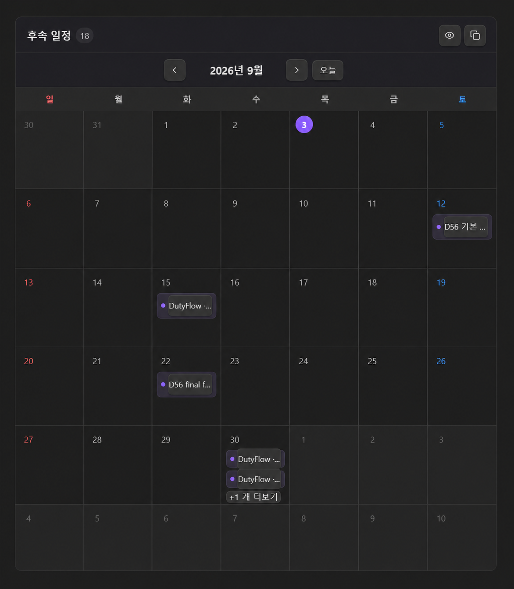
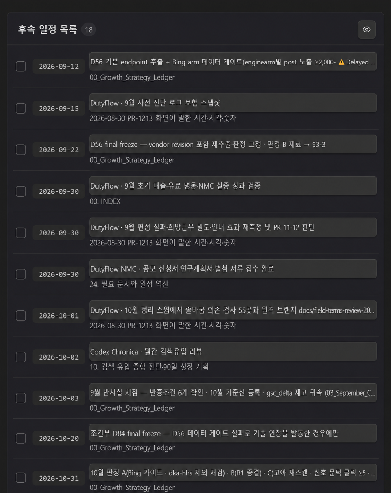

# Follow-up Calendar

**A simple, focused Obsidian calendar for dated follow-up tasks.**

<p align="center">
  <picture>
    <source media="(prefers-color-scheme: dark)" srcset="assets/synaphi-logo-dark.png">
    <source media="(prefers-color-scheme: light)" srcset="assets/synaphi-logo-light.png">
    
  </picture>
</p>

It does one job: finds Markdown tasks containing both `📅 YYYY-MM-DD` and `#follow-up`, then shows them in a clean calendar and list. No project system, no complicated workflow.

```markdown
- [ ] Project · Send the follow-up email 📅 2026-09-13 #follow-up #project
```

The plugin adds a calendar icon to the left ribbon. It opens a live calendar and a nearest-upcoming-first list backed by the original Markdown tasks.

## Features

- Compact month calendar with a stable six-week layout
- Nearest upcoming dates at the top of the list; recent overdue items follow
- One-click completion that updates the source task
- Copyable `follow-up-calendar` block for any note
- Automatic Obsidian language detection plus manual English/Korean selection
- Light and dark theme support using Obsidian theme variables

## Actual plugin screens

These are the real plugin views running inside Obsidian—not generated mockups.

### Calendar

<p align="center">
  
</p>

### Nearest upcoming list

<p align="center">
  
</p>

## Install manually

1. Download `main.js`, `manifest.json`, and `styles.css` from the latest release.
2. Put them in `<vault>/.obsidian/plugins/follow-up-calendar/`.
3. Reload Obsidian, then enable **Follow-up Calendar** under Community plugins.

## Live blocks

````markdown
```follow-up-calendar
weekStart: monday
showCompleted: false
```
````

Use `follow-up-list` instead of `follow-up-calendar` for the list view.

## Development

```bash
npm install
npm test
npm run build
npm run deploy:local -- C:\path\to\vault
```

## License

MIT
